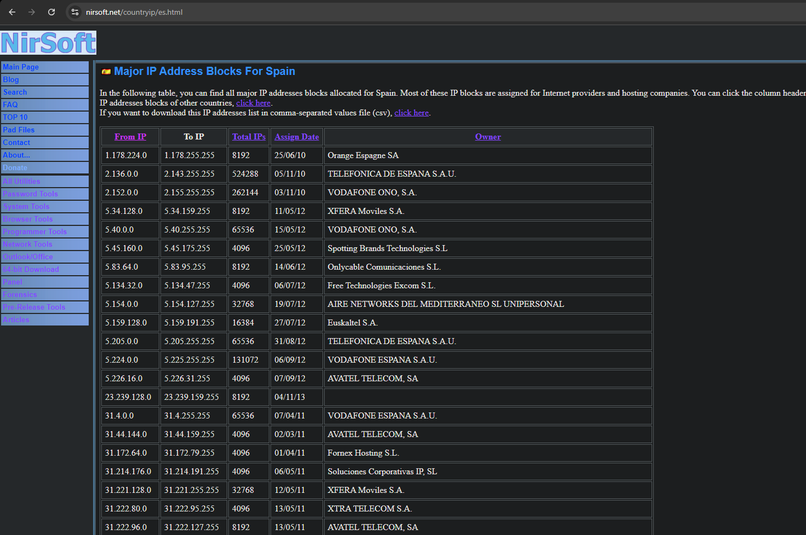
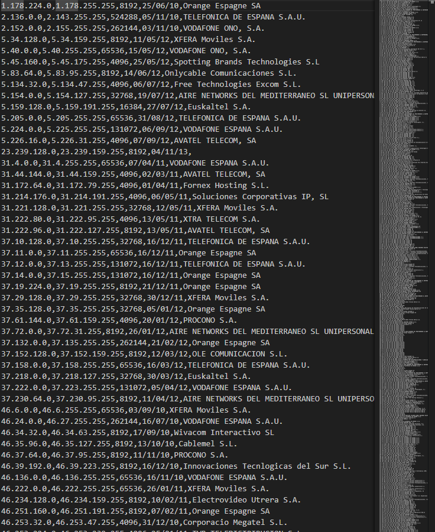
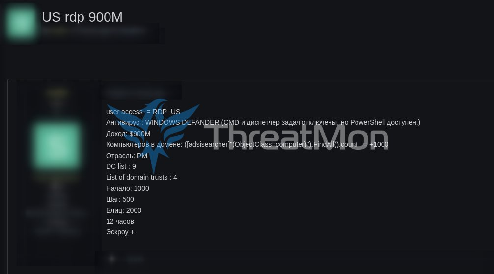

# Introduction

Welcome back again, I've been working on other hacking things but I never leave the blog. I have too much material for the blog and very interesting content, maybe in the following months I can't make too much posts because I'm ending my studies, but after that i'm going to have too much time to expend here.

<br>

Today I'm going to talk about how the most known cybercriminals used to break into company's, using massive reconnaissance followed of Bruteforce Attacks. I know that the bruteforce attack are actually not relevant, but on this days is a technique that pays off. Actually the cybercriminals keep selling accesses to big corps using this methodology of work.

*⚠ <span style="color:yellow">Advertisement</span>: The techniques & software explained on this document are purely educational.*

# Massive Reconnaissance

Firstly we need to make a recognizement of all RDPs available on the Internet, for that we search about the IPs of a whole country like Spain. For that we need to search for the ranges of IPs in Spain.



One page what I recommend is [nirsoft](nirsoft.net), we can see here the ip ranges of Spain and the Owners(Telecoms).

So we click on the second "click here" and we are going to download a .csv file with all range of the IPs.



`What we do next?`
Well I made a script in python to launch the masscan with the .csv IPs.<br>

Check it out

``` python
import os
import csv
import subprocess

def masscan(ip_range, ports, output):
    print(f"Escaneando Rangos: {ip_range}")
    command = f"masscan -p{ports} {ip_range} --rate=1000 -oG -"
    try:
        result = subprocess.run(command, shell=True, capture_output=True, text=True)
        if result.returncode == 0:
            with open(output, 'a') as file:
                file.write(result.stdout)
        else:
            print(f"Error {ip_range}: {result.stderr}")
    except Exception as e:
        print(f"Error al ejecutar masscan: {e}")

def main():
    csv = 'ranges.csv' # Nombre de el csv 
    output = 'ip_masscan.txt' # output

    if not os.path.isfile(csv):
        print(f"El archivo {csv} no existe.")
        return

    # Limpiar archivo
    with open(output, 'w') as file:
        file.write("")

    with open(csv, mode='r') as file:
        csv_reader = csv.reader(file)
        for row in csv_reader: # procesar cada rango de IPs
            if len(row) < 2:
                continue  # Saltar filas incompletas
            
            ip_start = row[0].strip()
            ip_end = row[1].strip()
            ip_range = f"{ip_start}-{ip_end}"
            
            masscan(ip_range, '3389', output) # AQUI ASIGNAMOS PUERTOS A ESCANEAR.

if __name__ == "__main__":
    main()
```

After run the script, we can see all is going great and we have to leave the program running a few hours.<br>

After that, we got the IPs on a txt.

So for bruteforcing the RDPs found, we can use some tools available in internet.

# Effectiveness for CyberCriminals & Easy Money

Well we can see how easy is possible to obtain valid IPs with RDP opened on internet.<br>

If we got a good wordlists to use on the bruteforce attack we can hit some servers.<br>

So what i do to test the bruteforce attack is use the credentials<br>

`usuario:usuario`

Which is a common default credentials used on corp & home computers.

Well with the bruteforce attack completed. I hit 2 servers on Spain. With the credentials `usuario:usuario`.

I was unable to connect to those servers due to the lack of privilege of the user `usuario`. Due to connect to a remote server throw RDP, you need a Remote User role.

Imagine if I was able to find servers with this weak credential still on 2024-2025, how much servers you can hit with a good worlist of credentials & passwords.

Now I'm going to share some screenshots of CyberCriminals selling accesses to RDP accesses on Russian Forums.



Well can see on this screenshot made by [MonThreat](https://x.com/MonThreat), a cybercriminal is selling a access to a **US** Company with a Revenue of **900** Million Dollars.<br>

We can see some details of the access given by the CyberCriminal.

``` Ruby
DC List: 9
List of domain trusts: 4
Computers on net: +1000
```

Those types of accesses with more of 2 domain trusts & +1000 Computers, is easy to determinate that the cybercriminal hit on a big company. <br>

The cybercriminal obtain the data of *DC List, Domain Trusts & Domain Computers* with those commands.

``` powershell
# Search how much AD Computers are on the net. 
echo AD_Computers: ([adsiSearcher]"(ObjectClass=computer)").FindAll().count

# List the lists of DC'S
nltest /dclist:

# List Domain Trusts
nltest /domain_Trusts
```

On this case, the user doesn't mention about how he gain the access into this server, but those type of user with current activitie of selling accesses usually use techniques like RDP Bruteforce and other techniques.<br>

Thank you so much for read this article, that although a somewhat basic document and very explained by other researchers what is promised is debt, and I had to explain another way to gain access through rdp to a company. See you soon ;).

# Bibliography

https://x.com/MonThreat
https://nirsoft.net
